# Ralph Lauren
1.Landing Page Made by Mohit Sharma(Captain)
***

A full-featured cloned ralph lauren website with user interface, carousel, and stack card and nested navigation dropdowns. Hosted Link : https://ralph-lauren.vercel.app/
***

##technologies used
***
 - HTML
 - CSS
 - Bootstrap
 - slick slider
 

###Screenshots
***

###Homepage
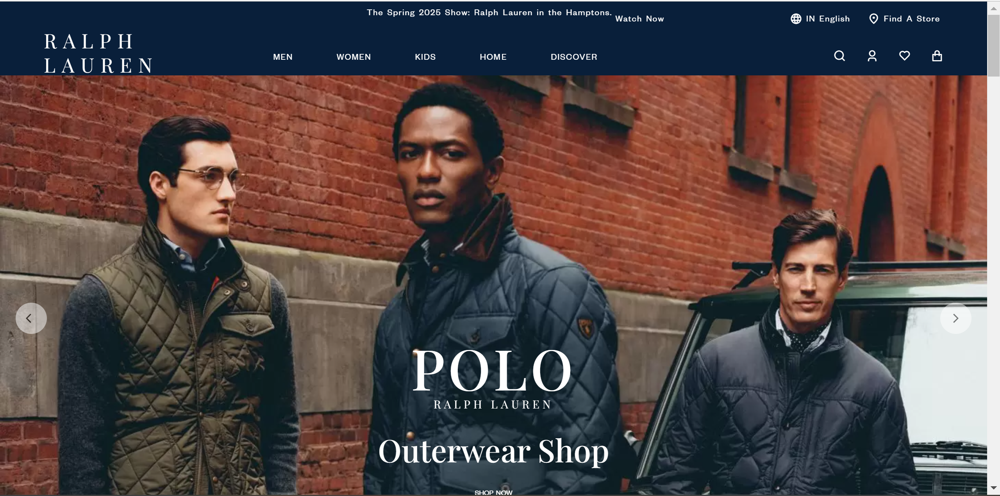

####Navigation bar
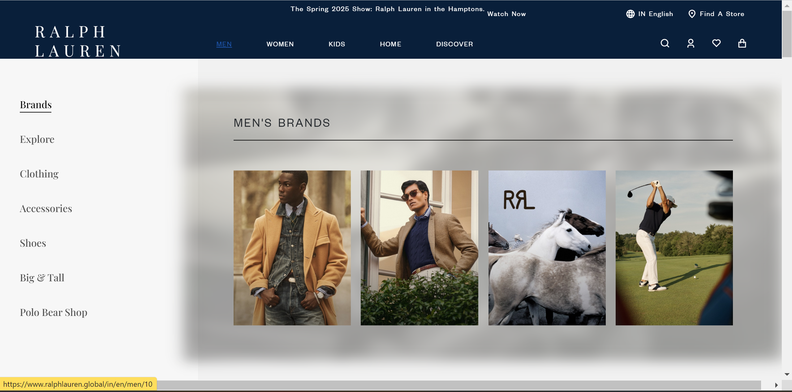

####Navigation On Hover User Form
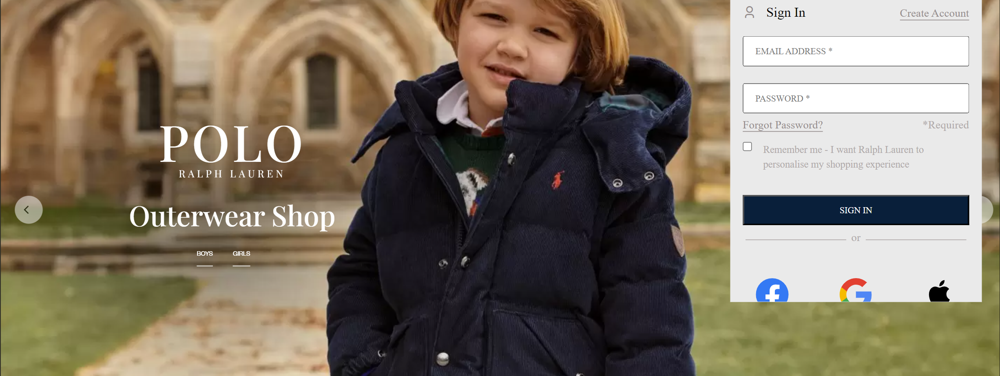 

###Landing page carousel
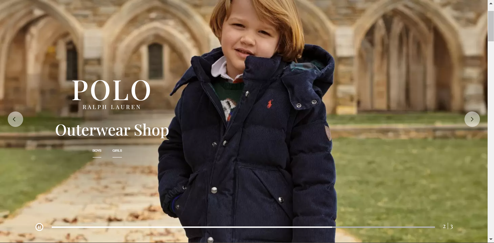

###slick card carousel
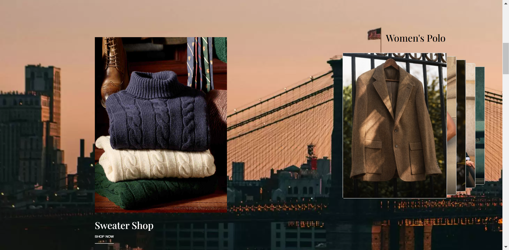

###Video background page with overlay content
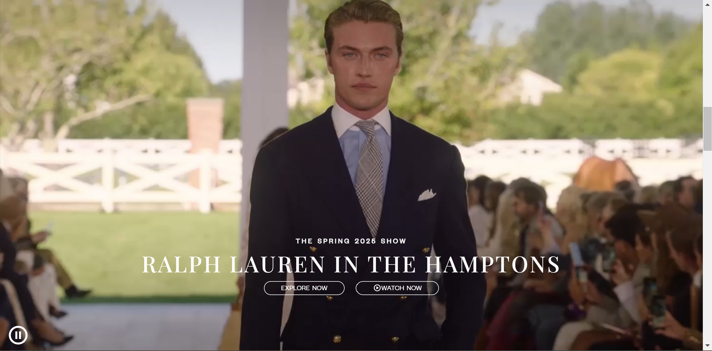

###Picture in background page with overlay content
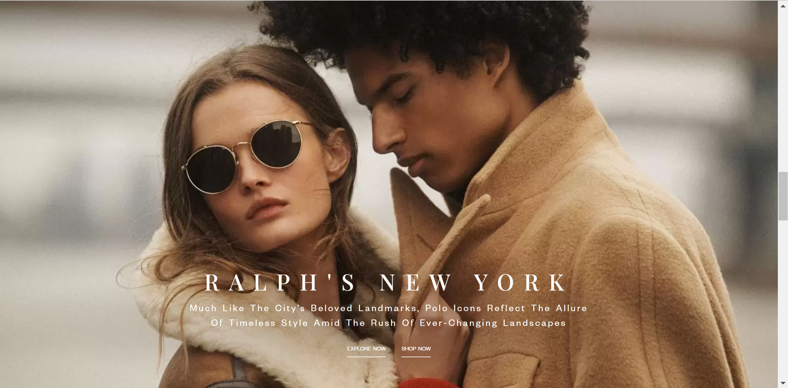

###Video background page 2 with overlay content
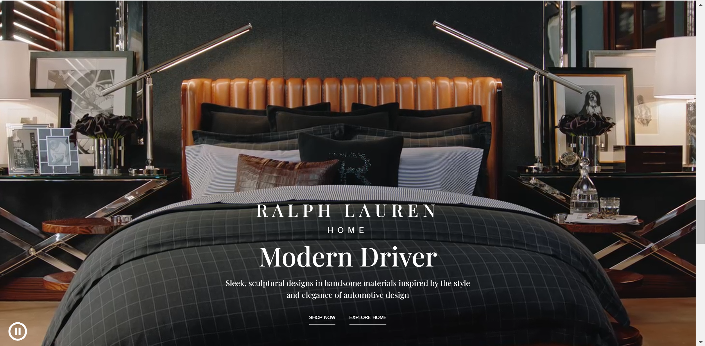

###Contents with card page
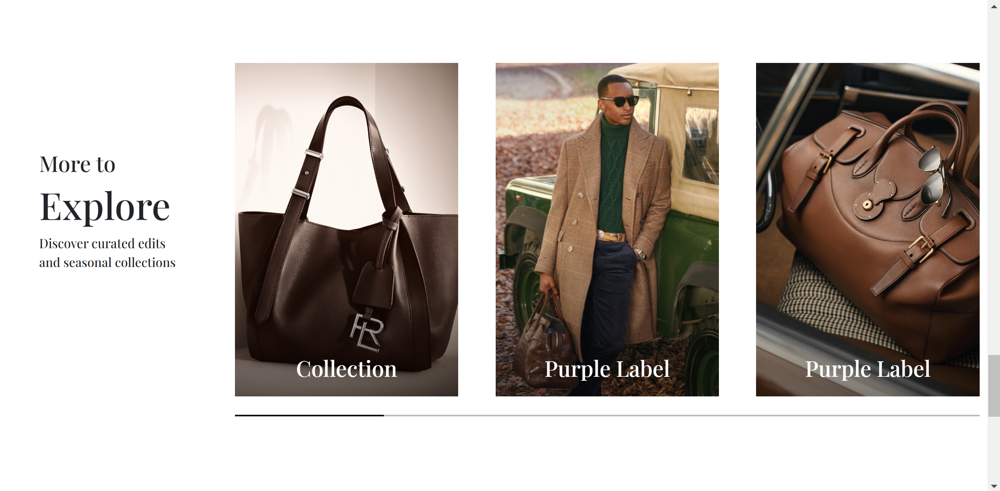

###Footer
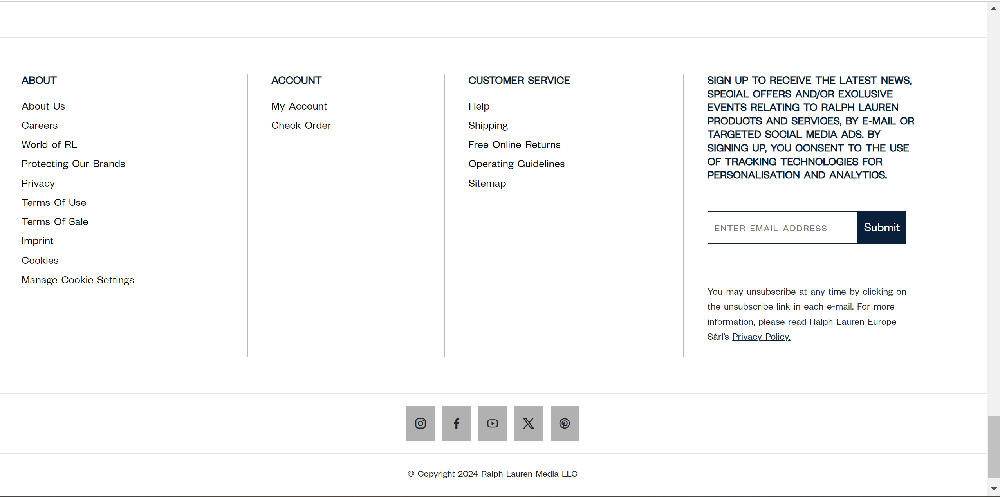

***
***
<!-- Parichay -->

<!-- POLO -->
### Section1
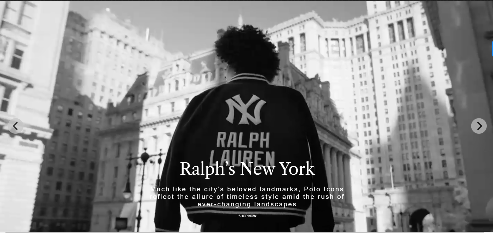

#### Section2

#### Section3
 

### Section4

### Section5

### Section6

### Section7

### Section8

### Section9

### Section10

### Footer

<!-- Purple section -->
###Section1

####Section2

####Section3
 

###Section4

###Section5

###Section6

###Section7

###Section8

###Section9

###Section10

###Footer

<!-- /Parichay -->